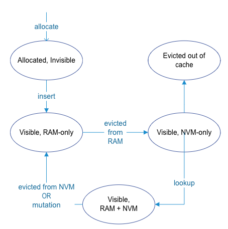

An *item* is the fundamental memory allocation backing an object in cache. Throughout this guide, we sometimes use item and allocation interchangeably. We use *allocation* when we discuss memory allocation or footprint. And we use *item* when we want to emphasize cached objects. An item is associated with a key and a byte array allocated by the `allocate()` method. We use the key to look up the item.

An `ItemHandle` is similar to a `std::shared_ptr<Item>`. Cachelib APIs like `find()`, `allocate()`, and `insertOrReplace()` return an `ItemHandle`. Because an item may be accessed concurrently, to ensure that the underlying memory backing the item is valid, use its `ItemHandle` to access it. This guarantees that during the lifetime of the `ItemHandle`, its item will never be evicted or reclaimed by any other thread.

In addition, `ItemHandle` also provides future semantics offered in Hybrid Cache(flash). For more information, see [Hybrid Cache](HybridCache/ ).

## Item memory overhead

When you call the `allocate()` method to allocate memory from cache for an item, cachelib allocates extra 31 bytes (overhead) for the item's metadata, which is used to manage the item's lifetime and other aspects. For example, cachelib stores a refcount, pointer hooks to the intrusive data structures for cache like hash table, LRU, creation time, and expiration time. Some of these are for internal book keeping; and others are accessible through the item's public API. For details, see allocator/CacheItem.h.

## ItemHandle lifetime

Like a `std::shared_ptr`, an `ItemHandle`'s lifetime is independent from the other instances of `ItemHandle` that point to the same item. Holding an ItemHandle guarantees that the item it points to is alive at least as long as this instance of `ItemHandle` is alive. The next section describes what *at least* means. An `ItemHandle` is only *movable*.

## Item lifetime

Items in cache can be evicted to make space for other new items. For any item, having its outstanding `ItemHandle` prevents us from evicting the item or release its memory due to slab release.

An item `x` without outstanding handles is destroyed immediately when you explicitly call `remove()` to remove it or call `insertOrReplace()` to replace it with another item having the same key as `x`'s. With outstanding handles, the item's memory is guaranteed to not be reclaimed until the last outstanding handle is dropped. It is similar to use a `shared_ptr` to ensure that the underlying object is not destroyed until the last reference goes out of scope.

See the following state diagram for the state of a cachelib item when we're using the HybridCache setup (ram + flash).

